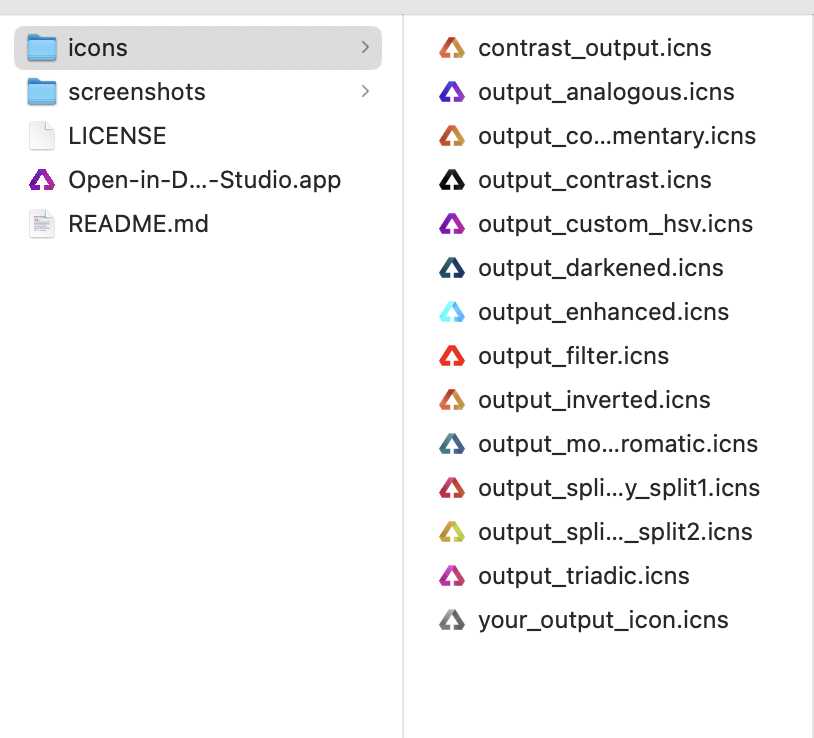

# Open-in-DevEco-Studio
[Open-in-DevEco-Studio](https://github.com/iHongRen/Open-in-DevEco-Studio) 是一个 MacOS 应用， 支持直接在 Finder 工具栏上，使用 **DevEco-Studio** 打开鸿蒙工程。


## 安装 & 使用

1、下载 `Open-in-DevEco-Studio.app` 后，拖放到 "**应用程序**"。

2、在**应用程序**里，按住 **cmd** 键，拖放 `Open-in-DevEco-Studio.app` 到 **Finder** 工具栏上。

3、点击后，根据提示给相应权限。

4、在 **Finder** 里找到鸿蒙项目，直接点击工具栏上的 `Open-in-DevEco-Studio.app` 就可以打开工程。


## 自定义应用图标

1、**右键**应用程序里的 `Open-in-DevEco-Studio.app` ，点击**显示包内容** -> Contents -> Resources -> ApplicationStub.icns 。

2、在 icons/ 目录，选一个偏好的 icon, 替换掉 ApplicationStub.icns。保持命名不变。

3、重启下 Finder 和 Dock。有缓存，图标变更得等一会儿才生效。

```sh
# 命令行
> killall Finder
> killall Dock
```




## 我的其他作品

[hpack](https://github.com/iHongRen/hpack) 鸿蒙HarmonyOS应用内部测试分发，一键打包、签名、安装工具。<a href="https://github.com/iHongRen/hpack" class="a-link" target="_blank"></a>

