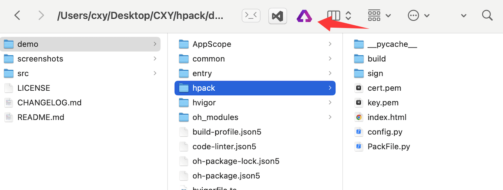
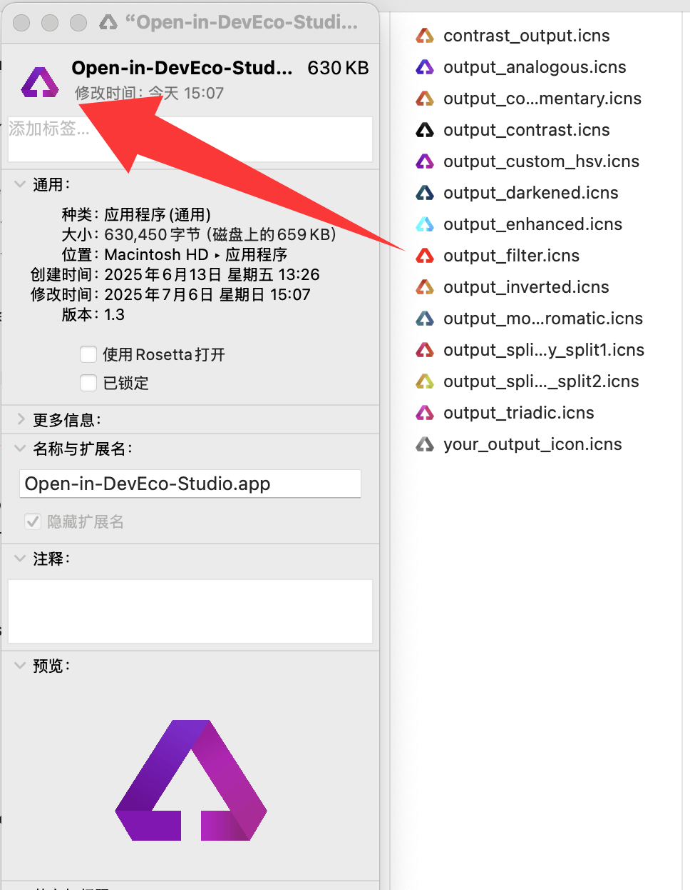

# Open-in-DevEco-Studio
[Open-in-DevEco-Studio](https://github.com/iHongRen/Open-in-DevEco-Studio) 是一个 MacOS 应用， 支持直接在 Finder 工具栏上，使用 **DevEco-Studio** 打开鸿蒙工程。




## 安装 & 使用

1、下载 `Open-in-DevEco-Studio.app` 后，拖放到 "**应用程序**"。

2、去除隔离属性，在终端执行命令：  
 ```sh
 sudo xattr -dr com.apple.quarantine /Applications/Open-in-DevEco-Studio.app
 ```

3、在**应用程序**里，按住 **cmd** 键，拖放 `Open-in-DevEco-Studio.app` 到 **Finder** 工具栏上。

4、点击后，根据提示给相应权限。

5、在 **Finder** 里找到鸿蒙项目，直接点击工具栏上的 `Open-in-DevEco-Studio.app` 就可以打开工程。


## 自定义应用图标

1、**右键**应用程序里的 `Open-in-DevEco-Studio.app` ，点击 **显示简介** 。

2、将喜欢的图标直接拖到箭头所指的位置进行替换




# 作者

[@仙银](https://github.com/iHongRen)

鸿蒙开源作品，欢迎持续关注 [🌟Star](https://github.com/iHongRen/Open-in-DevEco-Studio) ，[💖赞助](https://ihongren.github.io/donate.html)

1、[hpack](https://github.com/iHongRen/hpack) - 鸿蒙 HarmonyOS 一键打包上传分发测试工具。<a href="https://github.com/iHongRen/hpack" class="a-link" target="_blank"></a>

2、[Open-in-DevEco-Studio](https://github.com/iHongRen/Open-in-DevEco-Studio)  - macOS 直接在 Finder 工具栏上，使用
DevEco-Studio 打开鸿蒙工程。

3、[cxy-theme](https://github.com/iHongRen/cxy-theme) - DevEco-Studio 绿色护眼背景主题

4、[harmony-udid-tool](https://github.com/iHongRen/harmony-udid-tool) - 简单易用的 HarmonyOS 设备 UDID 获取工具，适用于非开发人员。

5、[SandboxFinder](https://github.com/iHongRen/SandboxFinder) - 鸿蒙沙箱文件浏览器，支持模拟器和真机

6、[WebServer](https://github.com/iHongRen/WebServer) - 鸿蒙轻量级Web服务器框架，类 Express.js API 风格。

7、[SelectableMenu](https://github.com/iHongRen/SelectableMenu) - 适用于聊天对话框中的文本选择菜单

8、[RefreshList](https://github.com/iHongRen/RefreshList) - 功能完善的上拉下拉加载组件，支持各种自定义。

